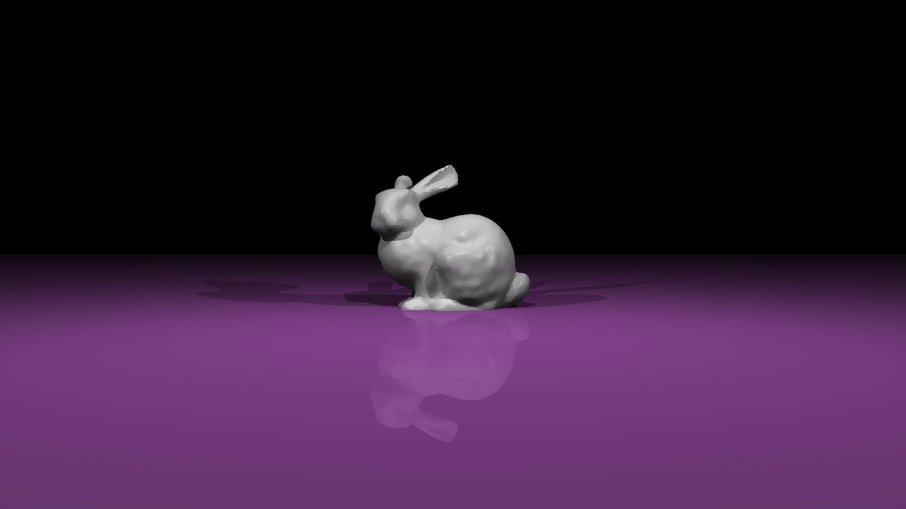

# CSC418Project

In this project, I reimplemented ray tracing algorithm with AABBTree. And I also modified the original mail.cpp to make the ray tracing program being able to run in parallelism.

It is not very necessary to talk about the AABBTree part of the program, as it has part of Assignment4.

For the multi-thread programming part, the approch I used to parallelize the program is letting every thread available for the program to do ray tracing for a single row of the image. After one thread finished its job, a new thread will be immediately created to do ray tracing on a new row of the image. By using this approach, we will be able to have good use of every available resourse for the program. The original ray tracing program can only use about 30% of the CPU resource on the cdf, while my parallelism implementation can use 100% CPU resource.

By combinning these two techinichs together, we will be able to finish running a ray tracing program on a bunny model with more than 13000 faces in less than 2 seconds.

I also reconstructed the structure of the code so that it should be easy to get refraction and UV mapping implemented in the code (however, I failed to do so due to mysterious bug in my implementation of these two parts). I implemented per_corner normal in Assignment 5 in order to show that my reconstruction on the code do make sense.

